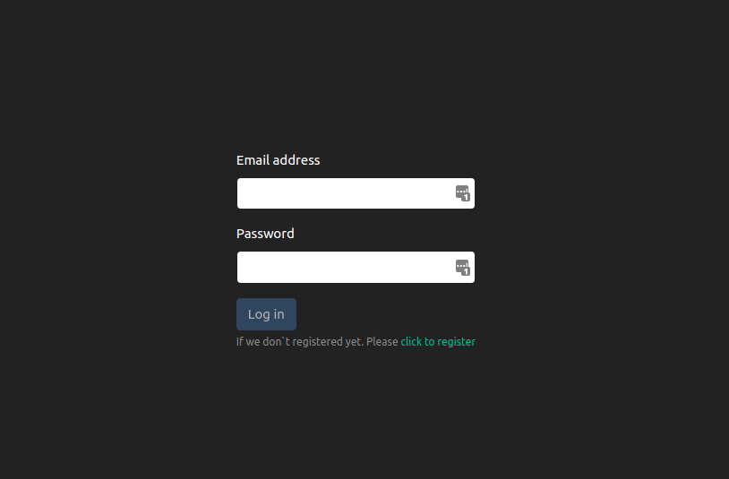
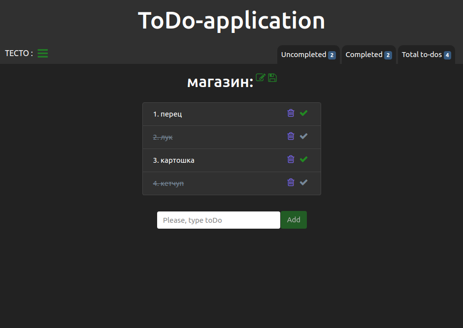

# To-do app

To-do SPA with simple backend on PHP.

## Features
1. Authorization and registration
2. Manage title of to-do list
3. Create to-do
4. Delete to-do
5. Checking to-do
6. Saving/loading to-do list
   
## Stack
1. Statefull class components
2. Context Api
3. Server class Api
4. Form validation
5. Local storage for saving active user
6. UseState hook for functional components
7. Global alert
8. Ref, React.forwardRef for focus inputs
9. React Router
   
*Screenshots:*

